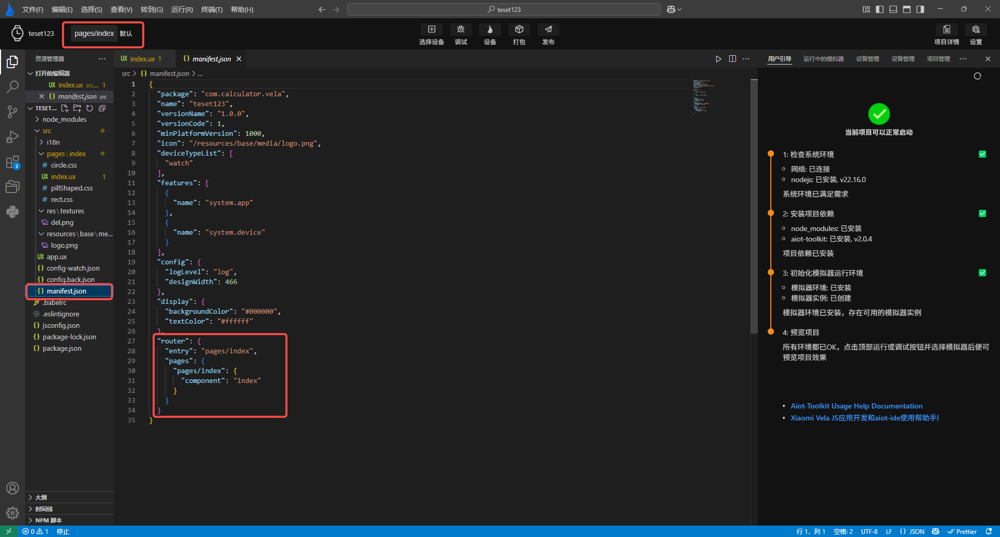

<!-- 源地址: https://iot.mi.com/vela/quickapp/zh/tools/debug/build-setting.html -->

# # 编译设置

编译设置功能可自定义模拟器运行时打开的页面和页面缓存,未进行设置时会默认读取项目中的`manifest.json`中的router配置

在顶部banner区域，增加了当前编译模式显示按钮，点击当前编译配置路由路径，可切换编译配置或点击新增添加新的编译配置

点击当前编译配置名称，可进入编译模式设置界面，选择对当前项目的编辑配置进行增删改。

