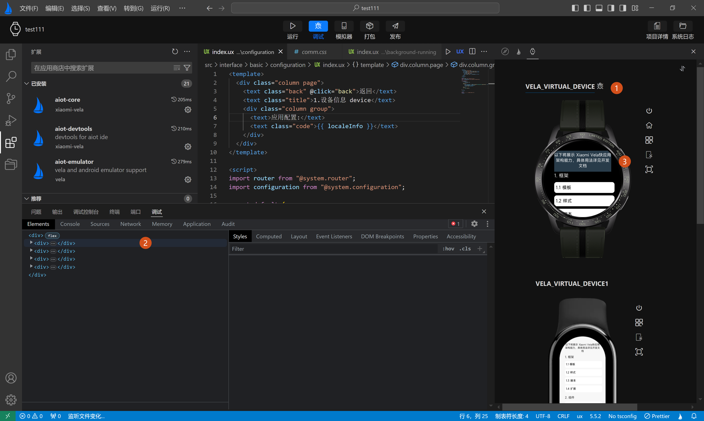
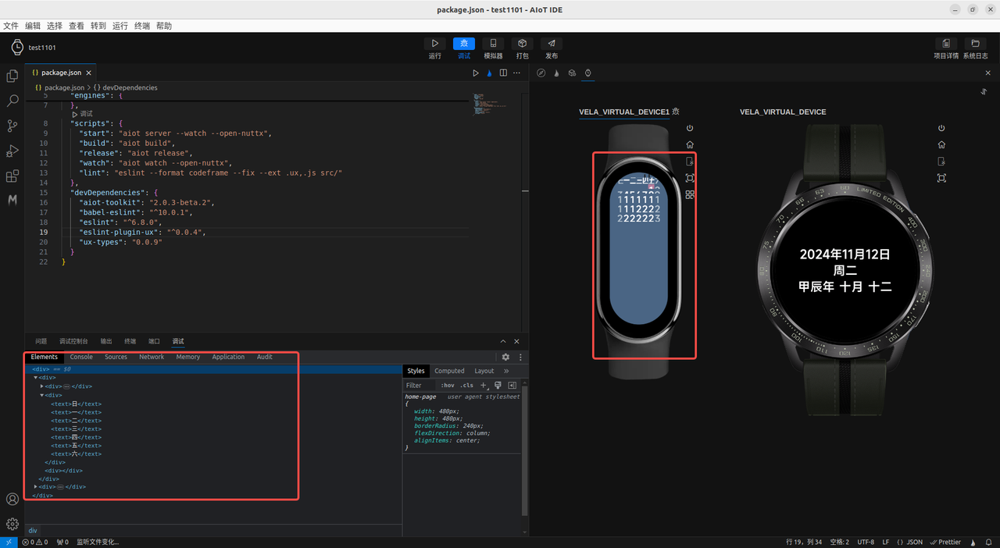
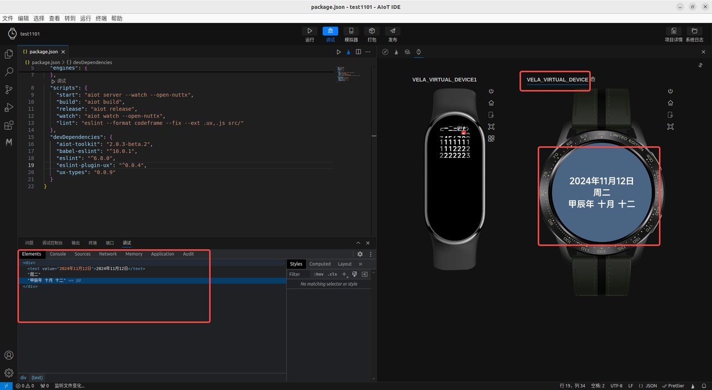

<!-- 源地址: https://iot.mi.com/vela/quickapp/zh/tools/debug/debug.html -->

## # 调试运行

点击`调试`按钮，选择要运行模拟器，点击确定，将启动对应模拟器。

模拟器启动成功后，将打开调试页面，当运行多个模拟器时。调试窗口对应的是(**如下图标签1，2，3** 所示)模拟器运行页面中**标题有选中效果** 的模拟器

点击模拟器，可切换调试服务，进行对应调试。

← [ 日志查看 ](</vela/quickapp/zh/tools/debug/watch-log.html>) [ 内存分析 ](</vela/quickapp/zh/tools/debug/memory.html>) → 

快速导航

调试运行
