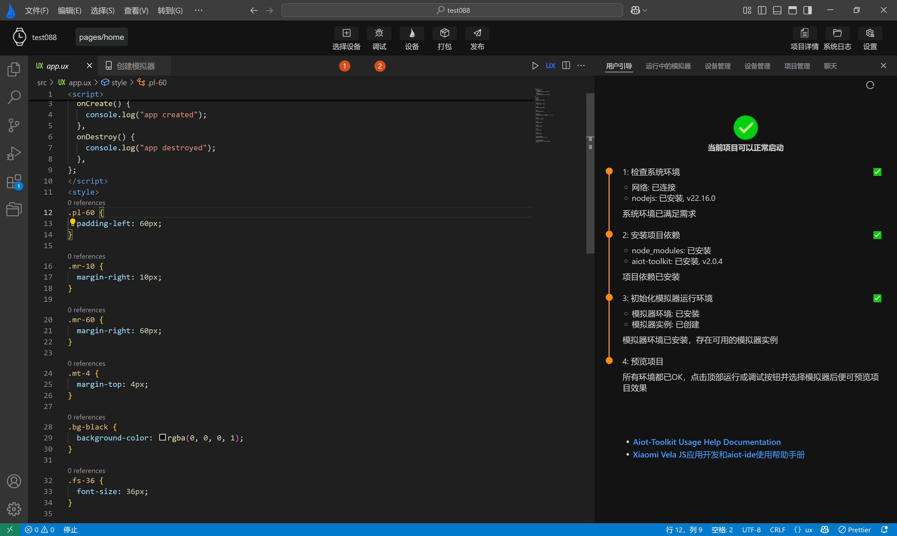

<!-- 源地址: https://iot.mi.com/vela/quickapp/zh/tools/debug/start.html -->

# 编译预览

运行，调试，发布，打包vela项目主要靠**顶部操作栏** 中的按钮来实现，同时依赖右侧**用户引导页** 和**设备管理页** 来保证当前开发环境具备**模拟器运行环境** ，同时展示效果具体显示在右侧的**模拟器预览界面** 。

## 运行项目

点击`选择设备`按钮，选择要运行的模拟器，点击确定后，再点击`调试`将启动模拟器。

模拟器启动运行成功后，模拟器会推送当前项目，推送成功后，可在模拟器预览页预览效果，如下动态图所示：

再次点击运行，将停止向模拟器推送当前项目，**但模拟器依然保持运行** 。
