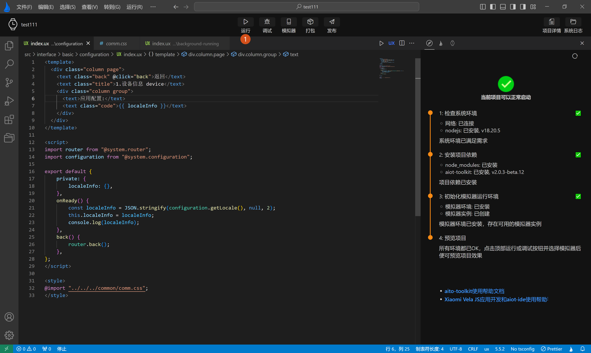
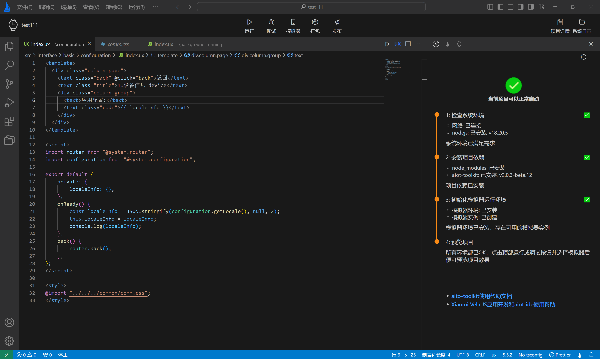

<!-- 源地址: https://iot.mi.com/vela/quickapp/zh/tools/debug/start.html -->

## # 编译预览

运行，调试，发布，打包vela项目主要靠**顶部操作栏** 中的按钮来实现，同时依赖右侧**用户引导页** 和**设备管理页** 来保证当前开发环境具备**模拟器运行环境** ，同时展示效果具体显示在右侧的**模拟器预览界面** 。

### # 运行项目

点击`运行`按钮，选择要运行的模拟器，点击确定后，将启动模拟器(**当本地只创建一个模拟器时无需选择，会直接运行**)。 

模拟器启动运行成功后，模拟器会推送当前项目，推送成功后，可在模拟器预览页预览效果，如下动态图所示：

再次点击运行，将停止向模拟器推送当前项目，**但模拟器依然保持运行** 。

← [ 应用热更新 ](</vela/quickapp/zh/tools/dev/build.html>) [ 日志查看 ](</vela/quickapp/zh/tools/debug/watch-log.html>) → 

快速导航

编译预览

运行项目
