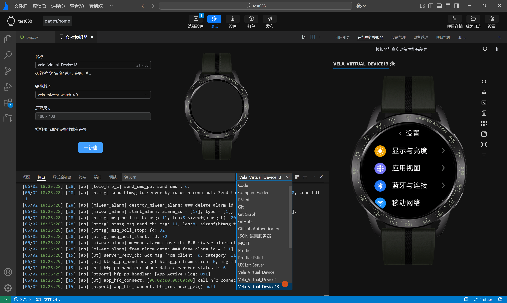

<!-- 源地址: https://iot.mi.com/vela/quickapp/zh/tools/debug/watch-log.html -->

# 日志查看

借助各项日志（如编译日志和模拟器日志），您可以迅速了解应用当前状态，从而提高开发效率。要查看日志，只需在`功能面板`中点击`输出`选项即可。日志输出面板提供了一系列实用功能，包括：`切换日志类型`、`清空日志`、`开启/关闭自动滚动`、`导出日志` 和 `筛选日志`等。

  * **切换日志类型** ：选择需要查看的日志类型，如模拟器日志、编译日志等。
  * **清空日志** ：一键清除当前类型的所有日志。
  * **开启/关闭自动滚动** ：当启用时，新日志添加到输出面板时，视图将自动滚动到最新的日志条目；关闭该功能后，自动滚动将停止，日志停留在上次查看的位置。
  * **导出日志** ：将当前类型的日志导出，保存至当前项目的 logs 目录下。
  * **筛选日志** ：在「输出」面板聚焦状态下，使用 `Command`\+ `F`（在Windows上使用 `Ctrl`\+ `F`）即可触发日志关键词搜索，支持正则表达式。

温馨提示：如果在开发中遇到异常，如预览黑屏或渲染内容与代码不一致，请首先查看**编译日志** 以确认应用是否构建成功，然后检查 **模拟器日志** 以判断应用是否正常运行。如果两者均无问题，请参阅文档或向`AIoT-IDE`官方寻求技术支持。
