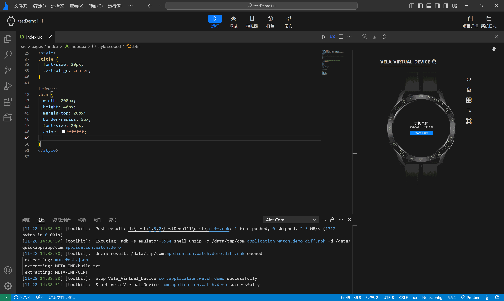
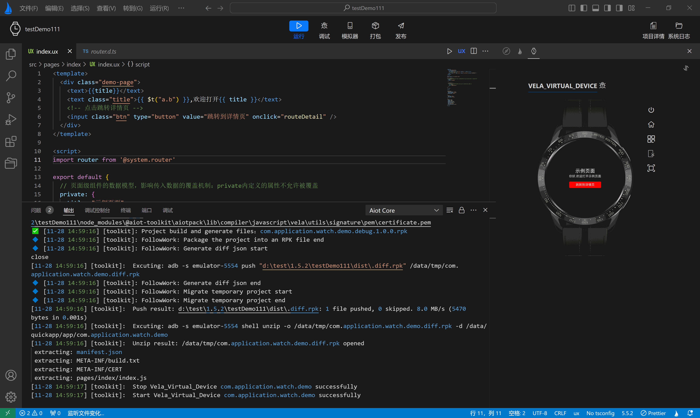
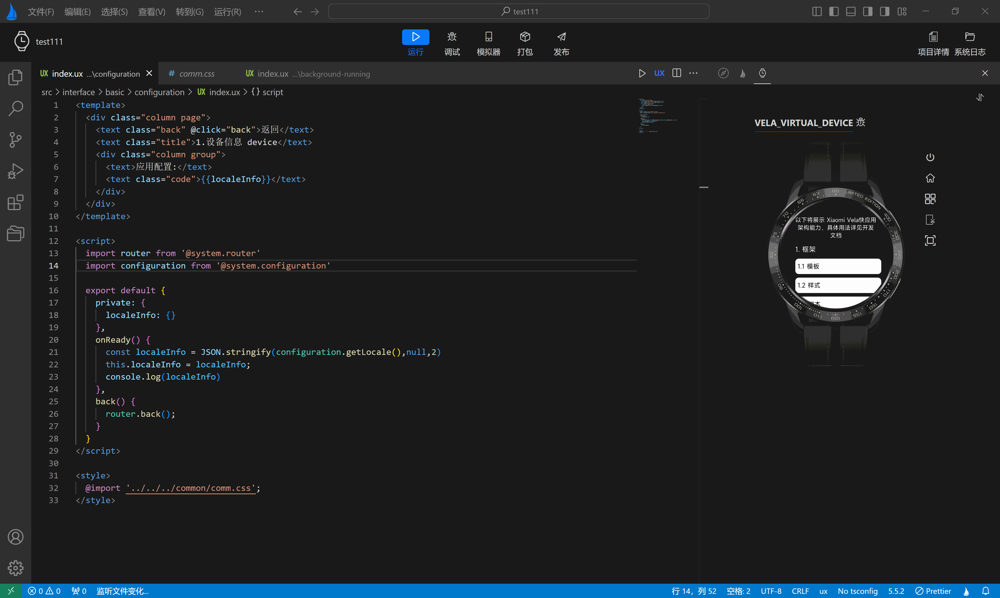

<!-- 源地址: https://iot.mi.com/vela/quickapp/zh/tools/dev/start.html -->

## # 代码补全

`AIoT-IDE` 是基于 Visual Studio Code 二次开发的，因此它继承了 VS Code 的所有代码编辑功能。此外，为了更贴合**Xiaomi Vela JS 应用** 的开发需求和提升开发者的体验，`AIoT-IDE` 内置了用于 ux 文件的语法功能，包括语法辅助和自动补全等。

#### # ux 文件自动补全

  * template 区域内补全 
    * 标签补全：输入 <（标签开头）后开始自动补全标签
    * 标签属性补全：自动补全通用属性和组件特有的属性
    * 标签属性值补全：如果存在枚举值，自动补全属性值

#### # style 区域内补全

  * CSS 属性补全：支持 Css 属性的自动补全；
  * CSS 属性值补全：支持 Css 属性值的自动补全。

#### # 其他补全

  * **路径补全** ：自动补全文件路径，如组件路径；
  * **class 值补全** ：根据 style 标签中定义的 class 值进行自动补全。

**ux 文件定义跳转**

  * **跳转支持** ：template 区域的 class 和 id，变量，方法，自定义组件跳转，script 区域的接口跳转等；
  * **跳转操作** ：Mac 下使用 command + 左键，Windows 下使用 ctrl + 左键，即可跳转至定义处。 

**ux文件链接跳转**

  * **链接跳转** ：可以从 ux 文件跳转到链接对应的文件；
  * **跳转操作** ：Mac 下使用 command + 左键，Windows 下使用 ctrl + 左键，即可实现跳转。

**ux 文件悬浮提示**

  * **标签提示** ：显示标签相关信息；
  * **属性值提示** ：显示标签属性值相关信息；
  * **样式提示** ：显示关于 style 的样式信息；
  * **脚本提示** ：显示 script 区域的方法，导入模块等提示信息。

← [ 运行模拟器 ](</vela/quickapp/zh/tools/emulator/emulator-run.html>) [ 代码美化 ](</vela/quickapp/zh/tools/dev/format.html>) → 

快速导航

代码补全
