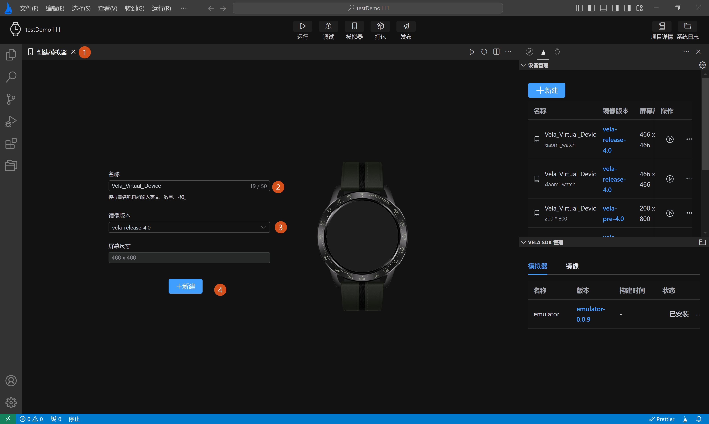
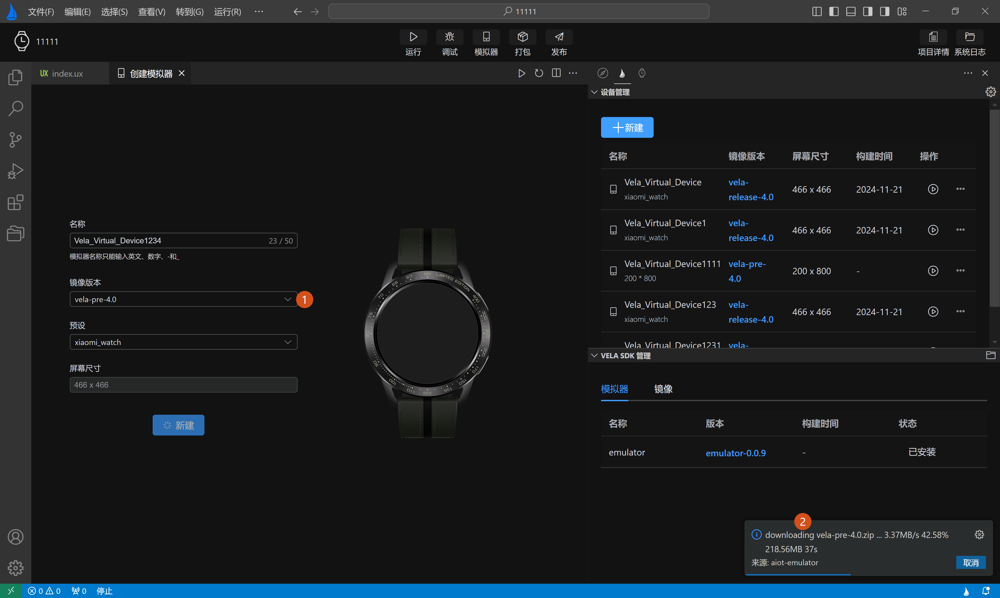
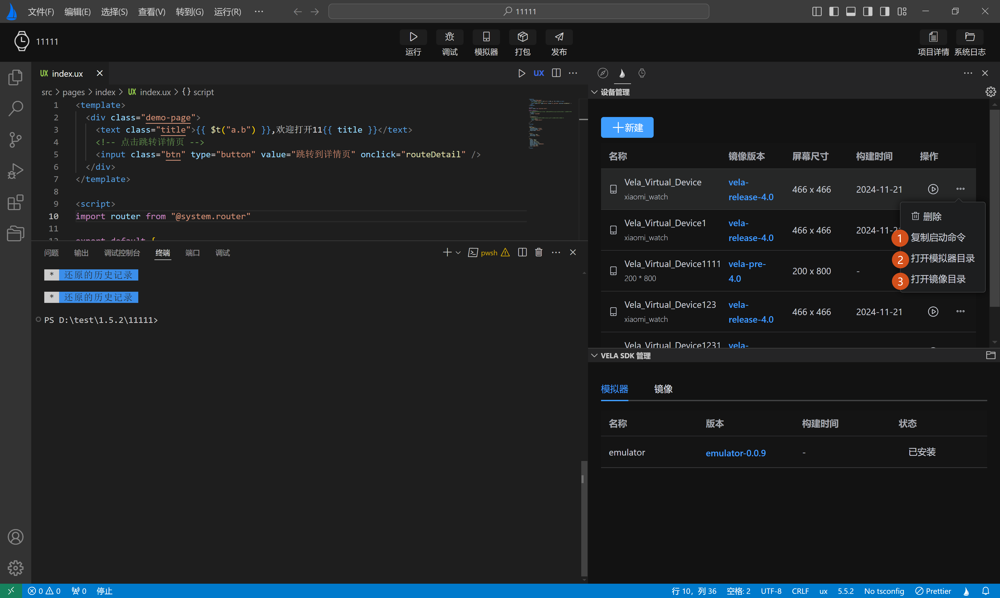

<!-- 源地址: https://iot.mi.com/vela/quickapp/zh/tools/emulator/create-emulator.html -->

## # 设备管理

设备管理页主要分为两部分：

  * **1.设备管理** ：提供对模拟器的增删改查和运行功能。
  * **2.模拟器SDK管理** ：提供对模拟器运行环境所需的SDK包的安装和更新。

#### # 新建模拟器

点击上图**新建** 按钮打开模拟器创建页面。首次进入**创建模拟器页面** ，镜像版本默认为`vela-release-4.0`，输入模拟器名称后，点击**新建** 即可完成创建。如下图**标签1，2，3，4** 所示：

除了默认的`vela-release-4.0`镜像，还可以在上图**标签3** 中，下拉选择`vela-pre-4.0`镜像，首次创建`vela-pre-4.0`镜像的模拟器时，将自动下载`vela-pre-4.0`镜像，因为用户引导页在初始化模拟器运行时，为了提升速度只下载了`vela-release-4.0`一种镜像，如下图**标签1，2** 所示：

在设备管理列表中，可对已创建的模拟器进行操作，目前提供了运行，暂停，删除等操作按钮。

此外，在设备管理列表中，为了方便用户操作，还提供了三个快捷配置：

1.**复制启动命令** ：复制当前模拟器的启动命令，方便用户通过命令行自启模拟器和模拟器启动失败时进行排查。  
2.**打开模拟器目录** ：打开模拟器文件存放目录，方便直接查看模拟器配置文件。  
3.**打开镜像文件** ：打开模拟器SDK包存放目录，方便直接查看模拟器SDK包文件。

← [ 管理项目 ](</vela/quickapp/zh/tools/project/project.html>) [ 运行模拟器 ](</vela/quickapp/zh/tools/emulator/emulator-run.html>) → 

快速导航

设备管理
