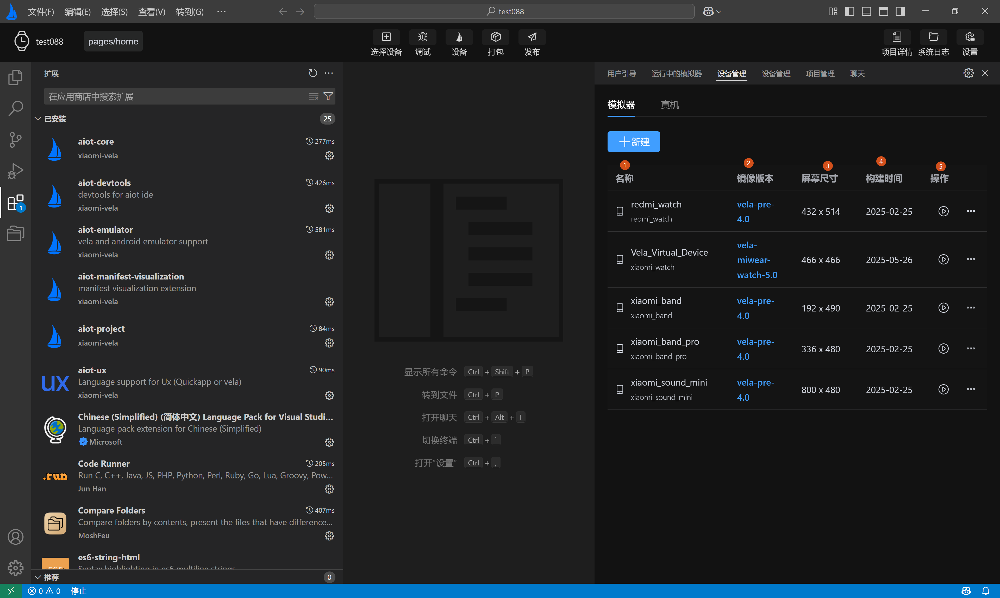
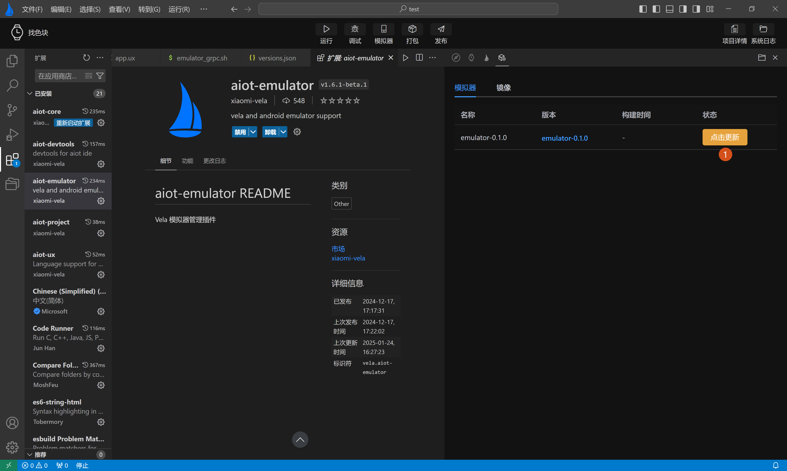

<!-- 源地址: https://iot.mi.com/vela/quickapp/zh/tools/emulator/create-emulator.html -->

# 设备管理

设备管理页主要分为两部分：

  * **1.模拟器版本管理** ：提供对模拟器的增删改查和运行功能，如下图1所示。
  * **2.Vela镜像版本管理** ：提供对模拟器运行环境所需的SDK包的安装和更新，如下图2所示。

## 模拟器设备管理

模拟器设备管理，主要展示模拟器的基本信息：

  * 名称
  * 镜像版本
  * 屏幕尺寸
  * 构建时间
  * 操作栏（提供删除，运行等功能）

此外，用户可以点击左上角新建按钮进入模拟器创建页面。

### 自动创建模拟器

在初次使用 `AIoT-IDE`开发工具时，在初始化模拟器环境时，会检测本地是否已经创建过模拟器，若本地没有创建过模拟器将会提示开发者是否要自动创建模拟器。

选择确定，将会在初始化环境后自动创建一个正式版模拟器。

选择创建所有设备模拟器，将会自动创建所有设备类型的模拟器。

### 新建模拟器

点击上图**新建** 按钮打开模拟器创建页面。首次进入**创建模拟器页面** ，镜像版本默认为`vela-miwear-watch-5.0`，输入模拟器名称后，点击**新建** 即可完成创建。如下图**标签1，2，3，4** 所示：

除了默认的`vela-miwear-watch-5.0`镜像，还可以在上图**标签3** 中，下拉选择`vela-miwear-watch-4.0`镜像和`vela-watch-4.0`镜像，如下图**标签1，2** 所示：

在设备管理列表中，可对已创建的模拟器进行操作，目前提供了运行，暂停，删除等操作按钮。

  * 此外，在设备管理列表中，为了方便用户操作，还提供了多个快捷配置：

    * **复制启动命令** ：复制当前模拟器的启动命令，方便用户通过命令行自启模拟器和模拟器启动失败时进行排查。

    * **打开模拟器目录** ：打开模拟器文件存放目录，方便直接查看模拟器配置文件。

    * **打开镜像文件** ：打开模拟器SDK包存放目录，方便直接查看模拟器SDK包文件。

    * **安装Rpk** ：在模拟器运行成功后，用于可选择本地环境里Rpk包，直接安装预览（模拟器非运行状态时禁用）。

    * **自定义镜像目录** ：当用于本地多有个镜像文件时，用户可以自定义镜像目录，运行自己本地的镜像文件。

    * **重置镜像目录为默认** ：用户自定义镜像目录后，可以通过重置镜像目录为将镜像运行目录重置为系统默认目录。

## 模拟器SDK管理

模拟器SDK管理主要分为两部分：

  * 模拟器内核，如下图1所示
  * 模拟器镜像，如下图2所示

模拟器SDK管理页面中主要从四个维度展示模拟器信息

  * 名称
  * 版本
  * 构建时间
  * 状态

每次启动`AIoT-IDE`时，会自动检测模拟器内核和模拟器镜像版本是否需要更新或安装，用户可以在列表的状态一栏中，查看到模拟器内核或被模拟器镜像是否安装或是否需要升级，可手动点击安装或升级，如下图1所示

## 设备使用配置

除了上面的基础功能，模拟器设备管理页面提供可一项单的的设备使用配置（如下图1所示）：

  * Adb Mode: 是否优先使用插件内置的adb模块，还是使用主机本地的adb模块（如下图2所示）
  * Hide Qt Window: 是否使用GRPC技术将模拟器嵌入到IDE中显示，否则在IDE外部弹出显示（如下图3所示）。

