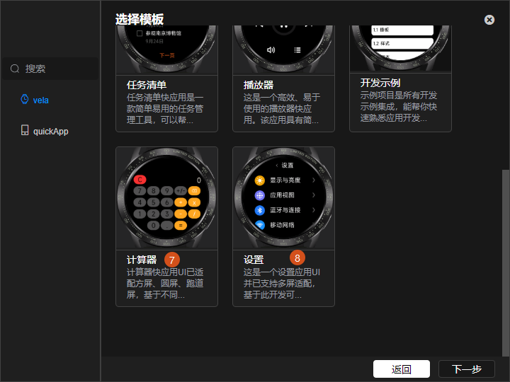
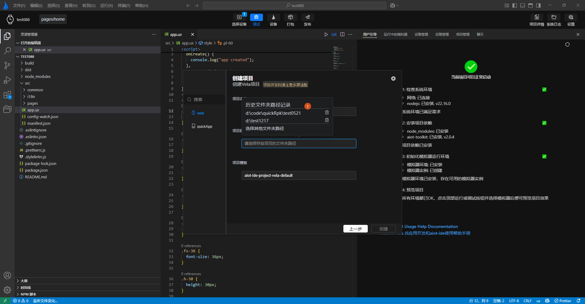

<!-- 源地址: https://iot.mi.com/vela/quickapp/zh/tools/project/creat-project.html -->

# # 新建项目

`AIoT-IDE`提供了对**Xiaomi Vela JS** 应用项目的新建和管理功能。

开发者初次使用`AIoT-IDE`时可按如下步骤打开新建项目弹窗创建项目：

  * 1.点击左上角文件按钮，出现下拉菜单。
  * 2.点击新建项目菜单，打开新建项目弹窗。

在新建项目时可选择项目类型，并通过我们提供的模板创建基础的**Xiaomi Vela JS** 应用项目，目前提供了八种基础模板：

  * 1.**Xiaomi Vela JS** 应用项目基础模板
  * 2.**Xiaomi Vela JS** 应用项目日历模板
  * 3.**Xiaomi Vela JS** 应用项目图表模板
  * 4.**Xiaomi Vela JS** 应用项目列表模板
  * 5.**Xiaomi Vela JS** 应用项目音乐播放器模板
  * 6.**Xiaomi Vela JS** 应用项目开发示例模板
  * 7.**Xiaomi Vela JS** 应用项目计算器模板
  * 8.**Xiaomi Vela JS** 应用项目设置面板模板

 

选择完模板后，点击下一步，请按下面步骤完成创建：

  * 1.输入项目名称
  * 2.选择创建目录(`AIoT-IDE`会记录用户曾选择过的创建目录，可直接选择)
  * 3.输入完相应表单内容，点击创建，即可创建成功。

创建成功后，`AIoT-IDE`会自动打开创建的项目，按引导页指示安装项目依赖后，即可运行项目(**下图标签1，2**)。

