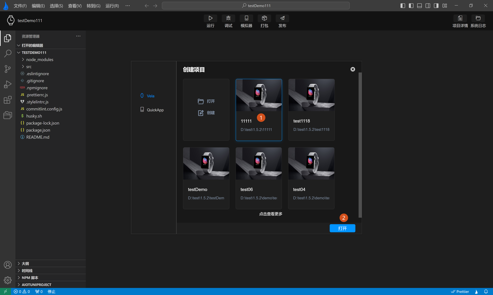
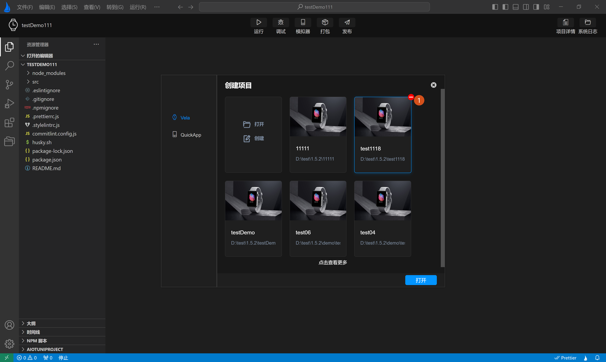

<!-- 源地址: https://iot.mi.com/vela/quickapp/zh/tools/project/project.html -->

## # 管理项目

对通过`AIoT-IDE`新建项目创建的**Xiaomi Vela JS** 应用项目，`AIoT-IDE`提供了删除和打开历史项目的功能。

#### # 打开历史项目

在打开新建项目弹窗时，可查看到已创建项目的历史信息卡片，选中其中一个项目，通过右下角打开按钮打开项目，如下图1，2所示：

#### # 删除项目

将鼠标移动至历史项目信息卡片的右上角，会出现删除按钮，点击删除按钮后会弹出**删除确认提示** ，点击确认即可删除项目。如下图**标签1** 所示：

← [ 项目类型 ](</vela/quickapp/zh/tools/project/template.html>) [ 设备管理 ](</vela/quickapp/zh/tools/emulator/create-emulator.html>) → 

快速导航

管理项目
