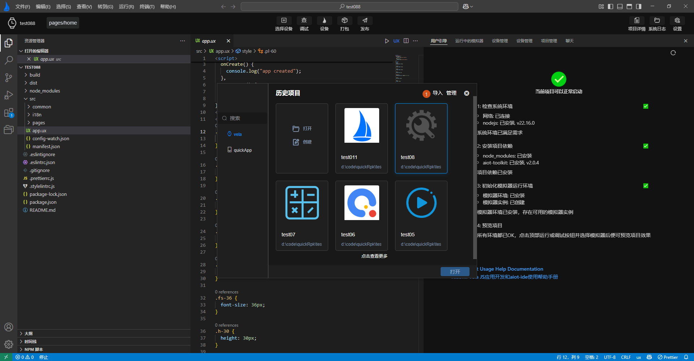

<!-- 源地址: https://iot.mi.com/vela/quickapp/zh/tools/project/project.html -->

# 管理项目

对通过`AIoT-IDE`新建项目创建的**Xiaomi Vela JS** 应用项目，`AIoT-IDE`提供了删除和打开历史项目的功能。

## 打开历史项目

在打开新建项目弹窗时，可查看到已创建项目的历史信息卡片，选中其中一个项目，通过右下角打开按钮打开项目，如下图1，2所示：

## 删除项目

将鼠标移动至历史项目信息顶部的**管理** 按钮，点击后每个卡片的右上角会出现一个勾选按钮，选择一个或多个历史项目后，可点击右下角删除项目。如下图**标签1，2，3** 所示：

## 导入项目

将鼠标移动至历史项目信息顶部的**导入** 按钮，点击后将会自动打开一个文件夹选择框，选择对应的项目类型进行导入，非qucikApp项目和**Xiaomi Vela JS** 应用项目将无法导入

