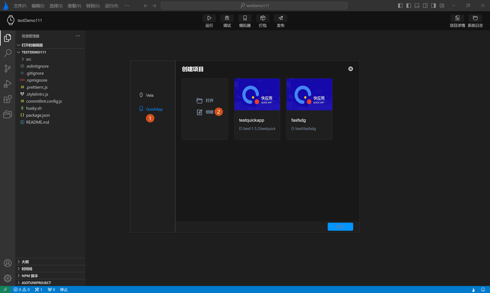
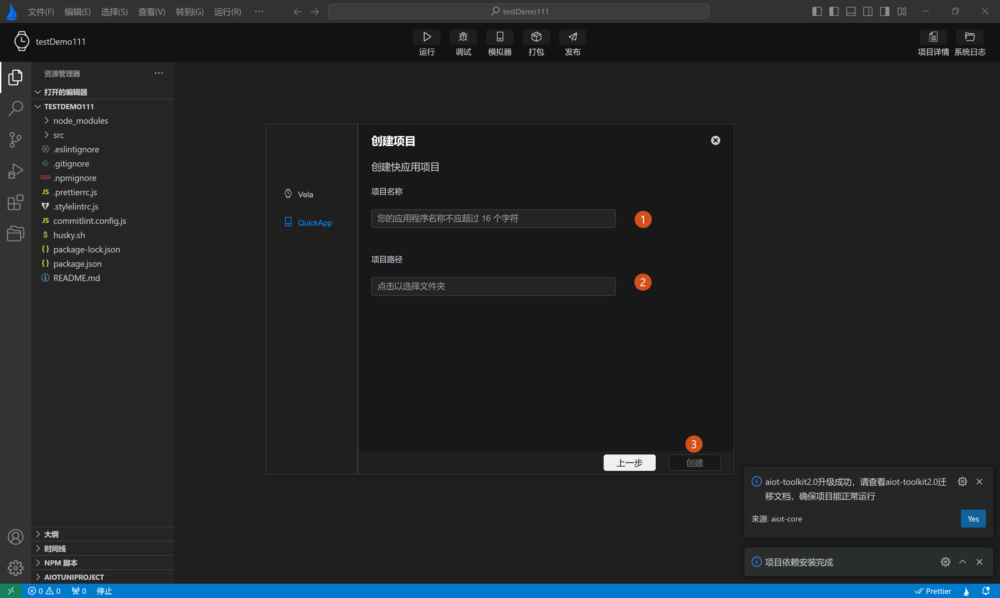

<!-- 源地址: https://iot.mi.com/vela/quickapp/zh/tools/project/template.html -->

## # 项目类型

**`AIoT-IDE`**不仅支持** Xiaomi Vela JS**应用项目，还支持对快应用项目的创建.

如上图**标签1，2** 所示，在打开**新建项目弹窗** 后，可左侧菜单栏选择**quickApp** ，再点击**创建** 进入创建页面，按输入提示输入创建信息，即可创建快应用项目。

← [ 新建项目 ](</vela/quickapp/zh/tools/project/creat-project.html>) [ 管理项目 ](</vela/quickapp/zh/tools/project/project.html>) → 

快速导航

项目类型
