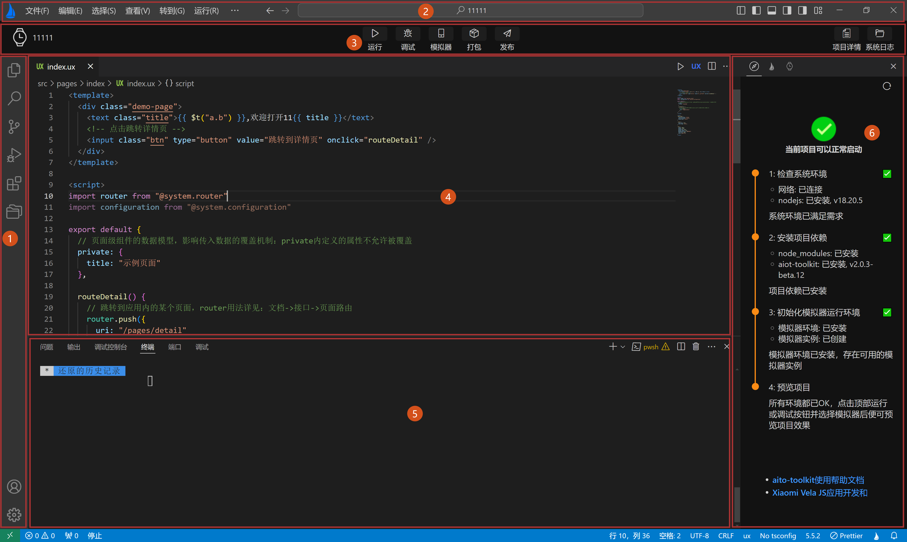
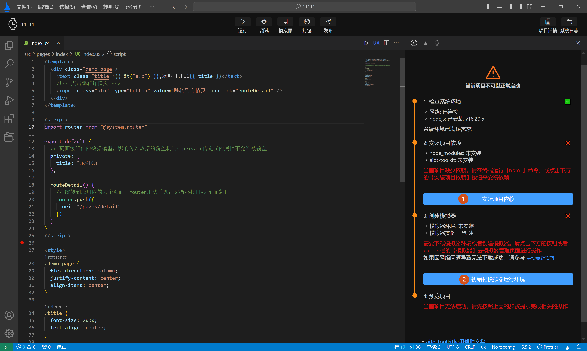
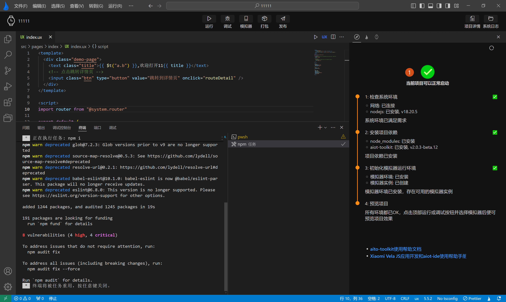
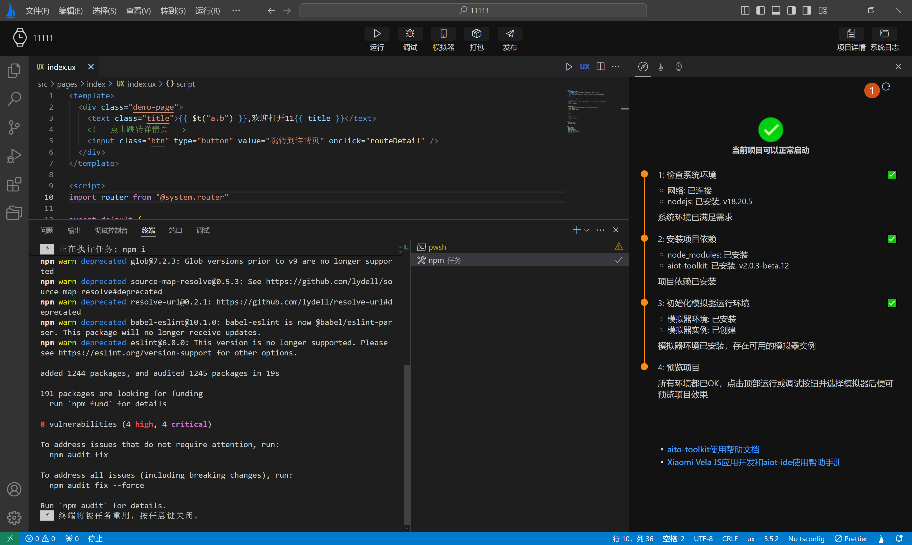
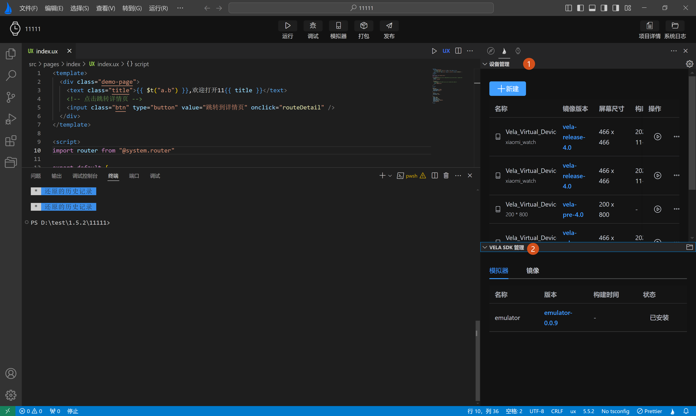
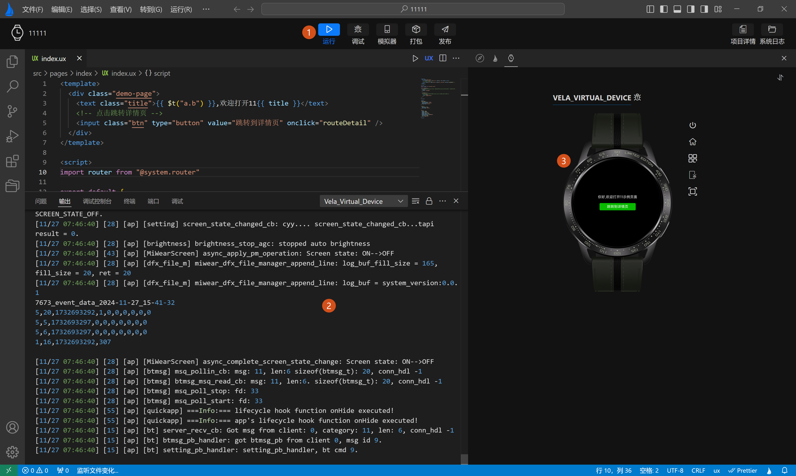

<!-- 源地址: https://iot.mi.com/vela/quickapp/zh/tools/start/project.html -->

## # 了解界面

### # 界面布局

**`AIoT-IDE`** 的主窗口由几个主要区域构成，具体如下：

1.**侧边栏** ：提供资源管理器、搜索、Git 管理、插件市场、快捷入口等功能。  
2.**菜单栏** ：包含文件、编辑、选择、视图、转到、终端、窗口、帮助等菜单项。  
3.**工具栏** ：包含修运行、调试、重启、打包、发布等功能按钮选项。  
4.**代码编辑区** ：包含代码编辑、定义跳转、代码补全、错误提示等功能，详情参阅代码补全。  
5.**功能面板** ：提供问题、输出、终端、调试等面板。  
6.**模拟器** ：包含引导页提示，仿真预览、模拟真机操作、截图等功能。   

只有通过`AIoT-IDE` 打开的是一个**Xiaomi Vela JS应用** ，主窗口界面才会如上图所示，`AIoT-IDE`会通过打开的项目结构自动识别打开的项目是否为**Xiaomi Vela JS应用项目** 。

#### # 工具栏界面

**`AIoT-IDE`** 工具栏界面中含有几个常用功能：

**运行** ：编译预览当前打开的**Xiaomi Vela JS** 应用项目。  
**调试** ：编译预览当前打开的**Xiaomi Vela JS** 应用项目，并打开调试面板，调试当前项目。  
**重启** ：重新编译预览当前打开的**Xiaomi Vela JS** 应用项目。  
**打包** ：可以生成 release 或 debug 类型的应用包（RPK）。  
**模拟器** ：创建不同镜像类型，设备类型的模拟器。  
**打包** ：将当前**Xiaomi Vela JS** 应用项目打包为rpk **发布** ：生成 release类型的应用包（RPK）

另外，`AIoT-IDE`支持直接预览`Xiaomi Vela JS`应用项目打包后的rpk，可将rpk解压后的目录通过`AIoT-IDE`打开，可对rpk进行预览。

### # 模拟器界面

模拟器界面主要包含三部分:

  * **用户引导页**
  * **模拟器SDK和设备管理更新页**
  * **模拟器运行预览页面**

#### # 用户引导页

模拟器**用户引导页** 会引导用户初始化**Xiaomi Vela JS** 应用模拟器运行环境。按引导页提示进行操作:

  * 1.**安装项目依赖** ，等待项目依赖和环境安装完成，才能正常编译预览**Xiaomi Vela JS** 应用项目
  * 2.**初始化模拟器环境** ，模拟器用户引导页会自动当前环境是否具备模拟器运行环境，如不具备可按用户引导页操作，**自动安装** 好模拟器环境

按照上图引导页提示**正确操作** 完毕后，引导页会给出项目可以**当前项目可以正常启动** 的提示，如下图中**标签1** 所示。

注意：**出于性能考虑** ，引导页不会轮询监测项目依赖和模拟器运行环境是否已经具备，当用户选择**自行手动安装** 的方式，安装好项目依赖和模拟器运行环境时，可点击**引导页右上角刷新** 按钮，刷新引导页状态。

#### # 设备管理页

设备管理页主要分为两部分：

  * **1.设备管理** ：提供对模拟器的增删改查和运行功能
  * **2.模拟器SDK管理** ：提供对模拟器运行环境所需的SDK包的安装和更新

#### # 模拟器运行预览页面

模拟器预览页是通过grpc技术将运行的模拟器内嵌到模拟器中，预览显示。当项目依赖和模拟器环境具备后，可按如下步骤预览当前项目：

  * 1.点击****顶部操作栏**** 的**运行** 或**调试** 按钮，运行模拟器，按钮进入**loading状态** ，运行成功后，会变为蓝色。
  * 2.底部工具栏开始输出模拟器运行日志，页面从用户引导页自动切换模拟器预览页面。
  * 3.模拟器运行成功，模拟器预览页将出现对应模拟器，并将当前打开的**Xiaomi Vela JS应用** 推送到运行的模拟器中。

← [ 关于AIoT-IDE ](</vela/quickapp/zh/tools/>) [ 新建项目 ](</vela/quickapp/zh/tools/project/creat-project.html>) → 

快速导航

了解界面

界面布局

模拟器界面
