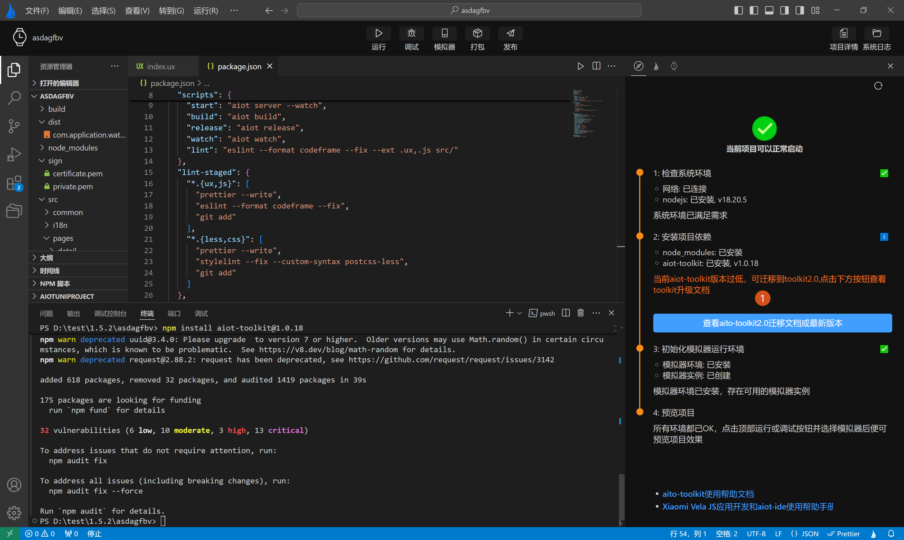
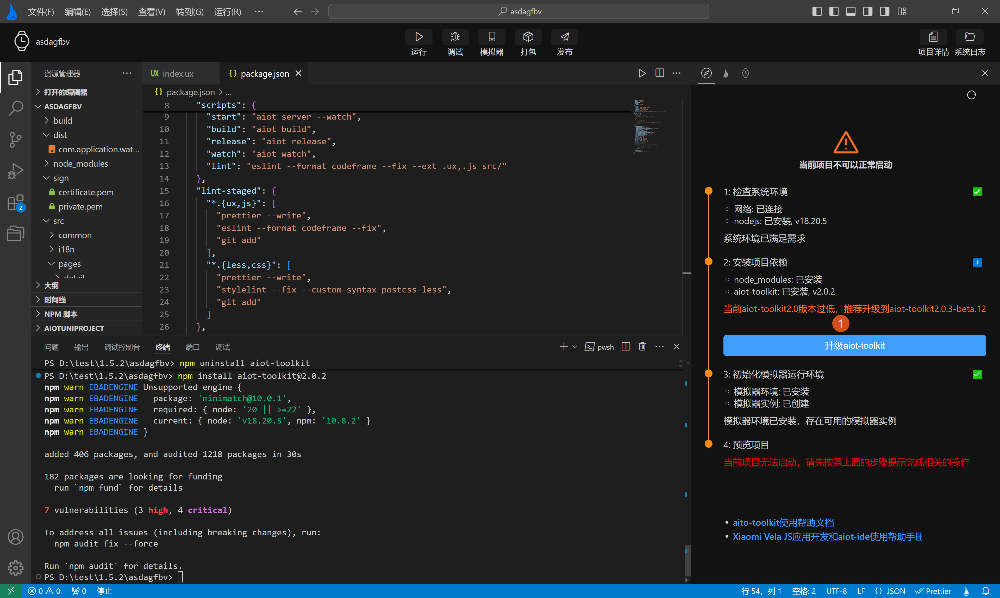

<!-- 源地址: https://iot.mi.com/vela/quickapp/zh/tools/toolkit/start.html -->

# # AIoT-toolkit

开发者在开发`Xiaomi Vela JS 应用`项目时，`AIoT-IDE`主要通过项目模板中内置的`AIoT-toolkit`完成项目的编译构建任务，得到构建文件（以 rpk 后缀命名，如：com.application.demo.rpk）。

## # 功能支持

`AIoT-toolkit`是将**源码项目** 转换为**目标代码项目** 并生成**目标代码应用** 的`命令行工具`，同时配备了 模拟器 相关功能供开发者使用。`AIoT-toolkit`提供了脱离`AIoT-IDE`，独立开发`Xiaomi Vela JS` 应用的能力。在不使用`AIoT-IDE`的情况下，可以完全通过`AIoT-toolkit`使用命令行工具进行开发，目前最新的**AIoT-toolkit2.0** 有以下常用命令：

  * 创建项目：**npm create aiot**
  * 直接运行：**aiot start** ，第一次运行会提示创建的模拟器，根据提示操作即可
  * 构建项目，生成rpk： **aiot build**
  * 构建项目-release模式：**aiot release**
  * 获取已连接设备列表: **aiot getConnectedDevices**
  * 获取设置平台：**aiot getPlatforms**
  * 创建`Xiaomi Vela JS`模拟器：**aiot crateVelaAvd**
  * 删除`Xiaomi Vela JS`模拟器：**aiot deleteVelafangAvd**

## # 版本支持

目前`AIoT-IDE`支持**AIoT-toolkit1.0** ，和**AIoT-toolkit2.0** ，对**AIoT-toolkit1.0** 的支持最小版本为`1.0.18`，对**AIoT-toolkit2.0** 的支持最小版本为`2.0.x`。当前最新的`AIoT-IDE`**1.6.0** 版本，推荐使用**2.0** ，**2.0** 提供了更快的编译速度和热更新支持，将给开发者提供更好的开发体验。

`AIoT-IDE`在打开一个`Xiaomi Vela JS`应用时，会主动检测**AIoT-toolkit** 版本，当前项目使用的是**AIoT-toolkit1.0时** 会提示你可以升级并查看迁移文档，如下图**标签1** 所示：



如果你项目中使用了**AIoT-toolkit2.0** ，但不是当前`AIoT-IDE`支持的最小正式版本，则会强制提示你升级。如下图**标签1** 所示：



## # 功能优化

对比**AIoT-toolkit1.0** ，**AIoT-toolkit2.0** 有以下重大改进：  
1.模板语法中可以直接写复杂函数

``` <div id="{{(x=> x+ y)(1)}}" onclick="(evt)=>{ const x = 10; return sum(x, evt, y) }"> </div> ```

2.class的变量可以包含多个类名(之前每个变量只能包含1个类名)

``` class="a {{x}}" // x="a1 a2 a3" ```

3.style可以是string，也可以是object(之前只是object)

``` <div style="a{{b}}c"> </div> ```

4.样式顺序可以随意写(之前必须按固定顺序)

``` border: solid red 10px; ```

5.错误提示定位到行列 

← [ 功能介绍 ](</vela/quickapp/zh/tools/devicedebug/start.html>) [ 升级迁移 ](</vela/quickapp/zh/tools/toolkit/update.html>) → 

快速导航

功能支持

版本支持

功能优化
