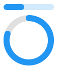

<!-- 源地址: https://iot.mi.com/vela/quickapp/zh/components/basic/progress.html -->

# progress

## 概述

进度条

## 子组件

不支持

## 属性

支持[通用属性](</vela/quickapp/zh/components/general/properties.html>)

名称 | 类型 | 默认值 | 必填 | 描述  
---|:---:|---|:---:|---  
percent | `<number>` | 0 | 否 | -  
type | horizontal | arc | horizontal | 否 | 进度条类型，不支持动态修改  
  
## 样式

支持[通用样式](</vela/quickapp/zh/components/general/style.html>)

注：horizontal progress 底色为#f0f0f0；height 属性失效

名称 | 类型 | 默认值 | 必填 | 描述  
---|:---:|---|:---:|---  
color | `<color>` | #33b4ff 或者 rgb(51, 180, 255) | 否 | 进度条的颜色  
stroke-width | `<length>` | 32px | 否 | 进度条的宽度  
layer-color | `<color>` | #f0f0f0 或者 rgb(240, 240, 240) | 否 | 进度条的背景颜色  
  
type=arc时生效：

名称 | 类型 | 默认值 | 必填 | 描述  
---|:---:|---|:---:|---  
start-angle | `<deg>` | 240 | 否 | 弧形进度条起始角度，以时钟0点为基线。范围为0到360（顺时针）  
total-angle | `<deg>` | 240 | 否 | 弧形进度条总长度，范围为-360到360，负数表示起点到终点为逆时针  
center-x | `<length>` | 组件宽度的一半 | 否 | 弧形进度条中心位置，（坐标原点为组件左上角顶点）。该样式需要和 center-y \ radius 一起使用  
center-y | `<length>` | 组件高度的一半 | 否 | 弧形进度条中心位置，（坐标原点为组件左上角顶点）。该样式需要和 center-x \ radius 一起使用  
radius | `<length>` | 组件宽高较小值的一半 | 否 | 弧形进度条半径，该样式需要和 center-x \ center-y 一起使用  
  
## 事件

支持[通用事件](</vela/quickapp/zh/components/general/events.html>)

## 示例代码
```html
< template > < div style = " flex-direction : column " > < progress class = " p1 " percent = " 40 " > </ progress > < progress class = " p2 " percent = " 80 " type = " arc " > </ progress > </ div > </ template > < style > .p1 { margin-bottom : 10px ; stroke-width : 12px ; } .p2 { margin-bottom : 10px ; stroke-width : 12px ; start-angle : 0 ; total-angle : 360deg ; } </ style >
```


