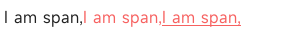

<!-- 源地址: https://iot.mi.com/vela/quickapp/zh/components/basic/span.html -->

# span

## 概述

格式化的文本，只能作为[`<text>`](</vela/quickapp/zh/components/basic/text.html>)、[`<a>`](</vela/quickapp/zh/components/basic/a.html>)和`<span>`的子组件。

## 子组件

仅支持`<span>`

## 属性

名称 | 类型 | 默认值 | 必填 | 描述  
---|:---:|---|:---:|---  
id | `<string>` |:---:| 否 | 唯一标识  
style | `<string>` |:---:| 否 | 样式声明  
class | `<string>` |:---:| 否 | 引用样式表  
for | `<array>` |:---:| 否 | 根据数据列表，循环展开当前标签  
if | `<boolean>` |:---:| 否 | 根据数据 boolean 值，添加或移除当前标签  
  
## 样式

名称 | 类型 | 默认值 | 必填 | 描述  
---|:---:|---|:---:|---  
color | `<color>` | rgba(0, 0, 0, 0.54) | 否 | 文本颜色  
font-size | `<length>` | 30px | 否 | 文本尺寸  
font-style | normal | italic | normal | 否 | -  
font-weight | normal | bold | `<number>` | normal | 否 | 当前平台仅支持`normal`与`bold`两种效果，当值为数字时，低于`550`为前者，否则为后者  
text-decoration | underline | line-through | none | none | 否 | -  
  
## 事件

不支持

## 示例代码
```html
< template > < div > < text > < span > I am span, </ span > < span style = " color : #f76160 " > I am span, </ span > < span style = " color : #f76160 ; text-decoration : underline ; " > I am span, </ span > </ text > </ div > </ template >
```


