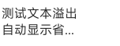

<!-- 源地址: https://iot.mi.com/vela/quickapp/zh/components/basic/text.html -->

# text

## 概述

文本内容写在标签内容区，支持转义字符`"\"`。

## 子组件

仅支持`<span>`

## 属性

支持[通用属性](</vela/quickapp/zh/components/general/properties.html>)

## 样式

支持[通用样式](</vela/quickapp/zh/components/general/style.html>)

名称 | 类型 | 默认值 | 必填 | 描述  
---|:---:|---|:---:|---  
lines | `<number>` | -1 | 否 | 文本行数，-1 代表不限定行数  
color | `<color>` | rgba(0, 0, 0, 0.54) | 否 | 文本颜色  
font-size | `<length>` | 30px | 否 | 文本尺寸  
font-style | normal | italic | normal | 否 |   
font-weight | normal | bold | `<number>` | normal | 否 | 当前平台仅支持`normal`与`bold`两种效果，当值为数字时，低于`550`为前者，否则为后者  
text-decoration | underline | line-through | none | none | 否 |   
text-align | left | center | right | left | 否 |   
text-indent | `<length>` | `<percentage>` |:---:| 否 | 规定文本块首行的缩进  
line-height | `<length>` |:---:| 否 | 文本行高  
text-overflow | clip | ellipsis | clip | 否 | 在设置了行数的情况下生效  
  
**示例**

  * 单行省略
```css
text { width : 150px ; lines : 1 ; text-overflow : ellipsis ; }
```


  * 多行省略，以两行为例
```css
text { width : 100px ; lines : 2 ; text-overflow : ellipsis ; }
```



## 事件

支持[通用事件](</vela/quickapp/zh/components/general/events.html>)

## 示例代码
```html
< template > < div > < text > 这是一段文本 </ text > </ div > </ template >
```


