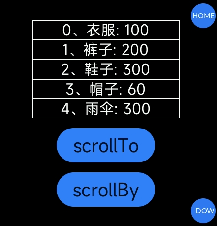

<!-- 源地址: https://iot.mi.com/vela/quickapp/zh/components/container/list.html -->

# list

## 概述

列表视图容器，包含一系列相同结构的列表项，连续、多行呈现同类数据。

## 子组件

仅支持[`<list-item>`](</vela/quickapp/zh/components/container/list-item.html>)

## 属性

支持[通用属性](</vela/quickapp/zh/components/general/properties.html>)

名称 | 类型 | 默认值 | 必填 | 描述  
---|:---:|---|:---:|---  
bounces | `<boolean>` | false | 否 | 是否边界回弹  
  
## 样式

支持[通用样式](</vela/quickapp/zh/components/general/style.html>)

使用时需要显式地设置高度。

## 事件

支持[通用事件](</vela/quickapp/zh/components/general/events.html>)

名称 | 参数 | 描述  
---|:---:|---  
scroll | {scrollX: `<number>`, scrollY: `<number>`, scrollState: `<stateValue>`} | 列表滑动；  
stateValue 取值说明：  
0：list停止滑动  
1：list正在通过用户的手势滑动  
2：list正在滑动，用户已松手  
scrollbottom |:---:| 列表滑动到底部  
scrolltop |:---:| 列表滑动到顶部  
scrollend |:---:| 列表滑动结束  
scrolltouchup |:---:| 列表滑动过程中手指抬起  
  
## 示例代码
```html
< template > < div class = " page " > < list class = " list " bounces = " true " onscroll = " onScroll " onscrolltop = " onScrollTop " onscrollbottom = " onScrollBottom " onscrolltouchup = " onScrollTouchup " > < list-item for = " {{productList}} " class = " item " type = " item " > < text > {{$item.name}}: {{$item.price}} </ text > </ list-item > </ list > </ div > </ template > < script > export default { private : { productList : [ { name : '衣服' , price : '100' } , { name : '裤子' , price : '200' } , { name : '鞋子' , price : '300' } , { name : '帽子' , price : '60' } , { name : '雨伞' , price : '300' } , { name : '书包' , price : '60' } , { name : '书本' , price : '30' } ] , } , onScroll (e) { console.log ('### list onScroll evt: ' , e) } , onScrollTop (e) { console.log ('### list onScrollTop evt: ' , e) } , onScrollBottom (e) { console.log ('### list onScrollBottom evt: ' , e) } , onScrollTouchup (e) { console.log ('### list onScrollTouchup evt: ' , e) } } </ script > < style > .page { justify-content : center ; align-items : center ; background-color : #000 ; } .list { width : 300px ; height : 200px ; border : 1px solid #fff ; } text { color : #fff ; } .item { height : 40px ; width : 100% ; align-items : center ; justify-content : center ; border : 1px solid #fff ; } </ style >
```

### 效果展示



## 方法

名称 | 参数 | 描述  
---|:---:|---  
scrollTo | Object | list 滚动到指定 item 位置  
scrollBy | Object | 使 list 的内容滑动一定距离  
  
**scrollTo 的参数说明：**

名称 | 类型 | 默认值 | 必填 | 描述  
---|:---:|---|:---:|---  
index | number | 0 | 否 | list 滚动的目标 item 位置  
behavior | smooth / instant / auto | auto | 否 | 是否平滑滑动，支持参数 smooth (平滑滚动)，instant (瞬间滚动)，默认值 auto，效果等同于 instant  
  
**scrollBy 的参数说明：**

名称 | 类型 | 默认值 | 必填 | 描述  
---|:---:|---|:---:|---  
left | number | 0 | 否 | 从当前位置水平方向滑动距离，单位 px。值为正时向左滑动，为负时向右滑动。flex-direction 为 column 或 column-reverse 时不生效  
top | number | 0 | 否 | 从当前位置垂直方向滑动距离，单位 px。值为正时向上滑动，为负时向下滑动。flex-direction 为 row 或 row-reverse 时不生效  
behavior | smooth / instant / auto | auto | 否 | 是否平滑滑动，支持参数 smooth (平滑滚动)，instant (瞬间滚动)，默认值 auto，效果等同于 instant
