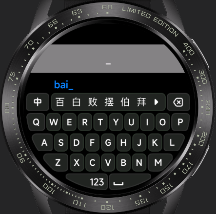
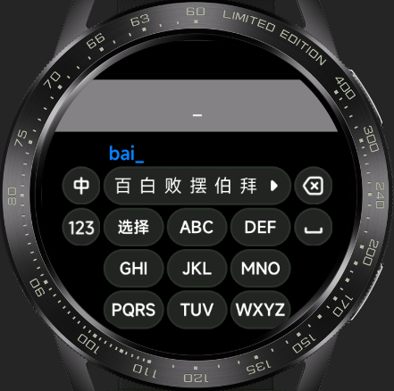

<!-- 源地址: https://iot.mi.com/vela/quickapp/zh/guide/developer-materials/extension-components.html -->

# 拓展组件

## input-method

### 概述

输入法组件，适配不同屏幕形状，支持两种主流键盘布局——全键盘模式和九键模式下的中英文输入

### 示例预览

#### 全键盘模式

  * 圆形屏幕

  * 矩形屏幕

  * 胶囊屏幕

#### 九键模式

  * 圆形屏幕

### 项目地址

  * [Github (opens new window)](<https://github.com/NEORUAA/Vela_input_method>)

