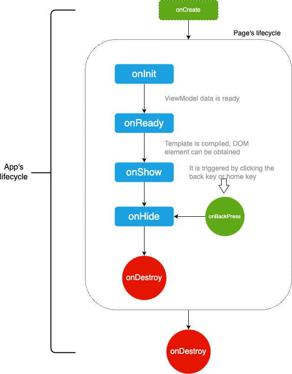

<!-- 源地址: https://iot.mi.com/vela/quickapp/zh/guide/framework/script/lifecycle.html -->

# 生命周期

  * 页面的生命周期：`onInit`、`onReady`、`onShow`、`onHide`、`onDestroy`、`onBackPress`、`onRefresh`、`onConfigurationChanged`
  * 页面的状态：`显示`、`隐藏`、`销毁`
  * APP 的生命周期：`onCreate`、`onShow`、`onHide`、`onDestroy` 、`onError`

## 生命周期图



## 页面的生命周期

由于页面通过`ViewModel`渲染，那么页面的生命周期指的也就是`ViewModel`的生命周期，包括常见的：onInit, onReady, onShow 在**页面创建** 时触发调用。

### onInit()

**表示`ViewModel`的数据已经准备好**，可以开始使用页面中的数据。

**示例如下：**
```javascript
private : { // 生命周期的文本列表 lcList : [ ] } , onInit() { this.lcList.push('onInit')console.info(` 触发：onInit `)// 执行：获取ViewModel的lcList属性：onInit console.info(` 执行：获取ViewModel的lcList属性： ${ this.lcList } `)// $app信息 console.info(` 获取：manifest.json的config.data的数据： ${ this . $app . $data.name } `)console.info(` 获取：APP文件中的数据： ${ this . $app . $def.data1.name } `)console.info(` 执行：APP文件中的方法 ` , this . $app . $def.method1())}
```

### onReady()

**表示`ViewModel`的模板已经编译完成**，可以开始获取 DOM 节点（如：`this.$element(idxxx)`）。

**示例如下：**
```javascript
onReady() { this.lcList.push('onReady')console.info(` 触发：onReady `)}
```

### onShow(), onHide()

APP 中可以同时运行多个页面，但是**每次只能显示其中一个页面** ；这点不同于纯前端开发，浏览器页面中每次只能有一个页面，当前页面打开另一个页面，上个页面就销毁了；不过和 SPA 开发有点相似，切换页面但浏览器全局 Context 是共享的。

所以页面的切换，就产生了新的事件：页面被切换隐藏时调用 onHide()，页面被切换重新显示时调用 onShow()。

**示例如下：**
```javascript
onShow() { this.lcList.push('onShow')console.info(` 触发：onShow `)} , onHide() { this.lcList.push('onHide')console.info(` 触发：onHide `)}
```

### onDestroy()

页面被销毁时调用，被销毁的可能原因有：用户从当前页面返回到上一页，或者用户打开了太多的页面，框架自动销毁掉部分页面，避免占用资源。

所以，页面销毁时应该做一些**释放资源** 的操作，如：取消接口订阅监听`geolocation.unsubscribe()`。

判断页面是否处于被销毁状态，可以调用 `ViewModel` 的 `$valid` 属性：`true` 表示存在，`false` 表示销毁。

**示例如下：**
```javascript
onDestroy() { console.info(` 触发：onDestroy `)console.info(` 执行：页面要被销毁，销毁状态： ${ this . $valid } ，应该做取消接口订阅监听的操作: geolocation.unsubscribe() `)// true，即将销毁 setTimeout(function() { // 页面已销毁，不会执行 console.info(` 执行：页面已被销毁，不会执行 `)} . bind(this), 0)}
```

**提示：**

  * `setTimeout`之类的异步操作绑定在了当前页面上，因此当页面销毁之后异步调用不会执行。

### onBackPress()

当用户`右滑返回`或点击`返回实体按键`时触发该事件。

如果事件响应方法最后返回`true`表示不返回，自己处理业务逻辑（完毕后开发者自行调用 API 返回）；否则：不返回数据，或者返回其它数据，表示遵循系统逻辑：返回到上一页。

**示例如下：**
```javascript
onBackPress() { console.info(` 触发：onBackPress `)// true：表示自己处理；否则默认返回上一页 // return true }
```

### onRefresh(query)

监听页面重新打开。

1.当页面在 manifest 中 launchMode 标识为'singleTask'时，仅会存在一个目标页面实例，用户多次打开目标页面时触发此函数。  
2.打开目标页面时在 push 参数中携带 flag 'clearTask'，且页面实例已经存在时触发。该回调中参数为重新打开该页面时携带的参数，详见[页面启动模式](</vela/quickapp/zh/guide/framework/other/launch-mode.html>)。

**示例如下：**
```javascript
onRefresh(query){ // launchMode 为 singleTask 时，重新打开页面时携带的参数不会自动更新到页面 this 对象上 // 需要在此处从 query 中拿到并手动更新 console.log('page refreshed!!!')}
```

### onConfigurationChanged(event)

监听应用配置发生变化。当应用配置发生变化时触发，如系统语言改变。

**参数**

参数名 | 类型 | 描述  
---|:---:|---  
event | Object | 应用配置发生变化的事件  
  
**event参数**

参数名 | 类型 | 描述  
---|:---:|---  
type | String | 应用配置发生变化的原因类型，支持的 type 值如下所示  
  
**event 中 type 现在支持的参数值如下**

参数名 | 描述  
---|---  
locale | 应用配置因为语言、地区变化而发生改变  
  
**示例如下：**
```javascript
onConfigurationChanged(evt){ console.log(` 触发生命周期onConfigurationChanged, 配置类型： ${ evt.type } `)}
```

## APP的生命周期

当前为 APP 的生命周期提供了五个回调函数：onCreate()、onShow()、onHide()、onDestroy()、onError(e)。

**示例如下：**
```javascript
export default { // 监听应用创建,应用创建时调用 onCreate() { console.info('Application onCreate')} , // 监听应用返回前台,应用返回前台时调用 onShow() { console.info('Application onShow')} , // 监听应用退到后台,应用退到后台时调用 onHide() { console.info('Application onHide')} , // 监听应用销毁,应用销毁时调用 onDestroy() { console.info('Application onDesteroy')} , // 监听应用报错,应用捕获异常时调用,参数为Error对象。 onError(e){ console.log('Application onError' , e)} , // 暴露给所有页面，在页面中通过：this.$app.$def.method1()访问 method1() { console.info('这是APP的方法')} , // 暴露给所有页面，在页面中通过：this.$app.$def.data1访问 data1 : { name : '这是APP存的数据' } }
```
