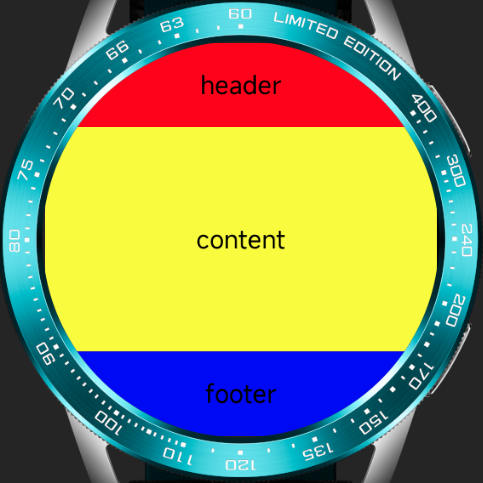
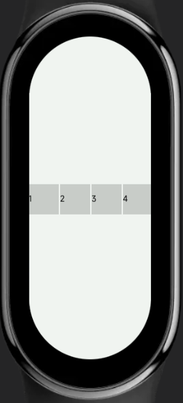
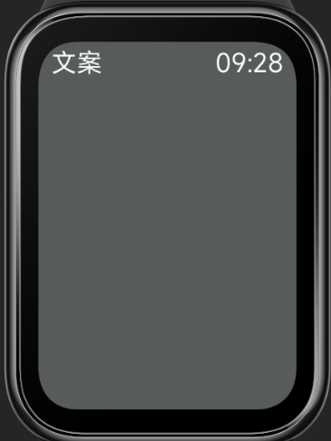
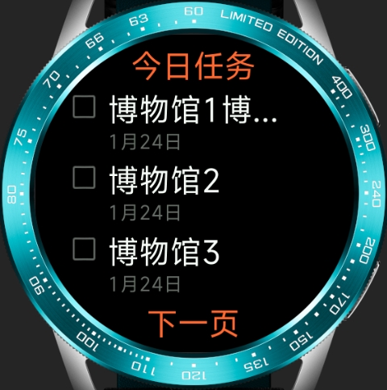
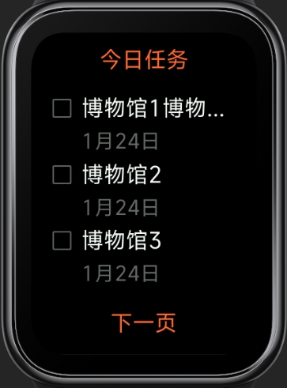

<!-- 源地址: https://iot.mi.com/vela/quickapp/zh/guide/multi-screens/samples.html -->

# 代码示例

## 页面布局及元素适配

一些开发中常见的跨屏适配示例。

### 自适应容器大小

使用百分比或flex样式替代px写固定容器大小的布局方式可以在多屏适时有更好的兼容性。比如长列表滚动的场景，示例如下：
```html
< template > < div class = " demo-page " > < text class = " title " > 长列表 </ text > < list class = " list " > < list-item class = " item " type = " custom " for = " {{listData}} " > < text > {{$item.name}} </ text > </ list-item > </ list > </ div > </ template > < script > export default { private : { listData : [ { name : 'TEST1 TEST1 TEST1' } , { name : 'TEST2 TEST2 TEST2' } , { name : 'TEST3 TEST3 TEST3' } , { name : 'TEST4 TEST4 TEST4' } , { name : 'TEST5 TEST5 TEST5' } , { name : 'TEST6 TEST6 TEST6' } , { name : 'TEST7 TEST7 TEST7' } , { name : 'TEST8 TEST8 TEST8' } , { name : 'TEST9 TEST9 TEST9' } , { name : 'TEST10 TEST10 TEST10' } ] } } </ script > < style > .demo-page { flex-direction : column ; align-items : center ; background-color : #fff ; } .title { margin-top : 50px ; padding : 20px 0 ; font-size : 32px ; } .list { flex : 1 ; width : 340px ; margin-bottom : 5px ; align-items : center ; } .item { width : 100% ; height : 100px ; margin-bottom : 20px ; border-radius : 20px ; background-color : #ccc ; text-align : center ; } text { width : 100% ; font-size : 30px ; text-align : center ; color : #000 ; } </ style >
```

效果展示：

圆形屏幕 / 矩形屏 / 胶囊屏

  

### 单页三行布局

手表、手环场景下单页面三行布局是比较常用的一种设计方式，页面结构大致分为顶部标题栏，底部按钮交互区域以及中部主体内容区。建议采用顶部底部高度固定，主体部分高度自适应的方式来做整体布局。

代码示例：
```html
< template > < div class = " demo-page " > < div class = " header " > < text > header </ text > </ div > < div class = " content " > < text > content </ text > </ div > < div class = " footer " > < text > footer </ text > </ div > </ div > </ template > < script > export default { } </ script > < style > .demo-page { width : 466px ; height : 466px ; flex-direction : column ; } .header { width : 100% ; height : 100px ; background-color : red ; } .content { flex : 1 ; background-color : yellow ; } .footer { width : 100% ; height : 100px ; background-color : blue ; } text { width : 100% ; font-size : 30px ; color : black ; text-align : center ; } </ style >
```

效果展示：

圆形屏幕 / 矩形屏 / 胶囊屏

  

### px自动缩放计算

px长度单位会根据配置的项目配置基准宽度进行换算，过程中产生的小数位会做四舍五入处理。因此，在一些需要精准计算的场景中需要考虑到换算带来的误差值（通常为+-1px）。

比如下面这个示例， 在计算行宽的时候没考虑误差，导致某些设备上产生渲染错行的问题：

  

代码示例：
```html
< template > < div class = " demo-page " > < div class = " item " for = " nums " > < text > {{$item}} </ text > </ div > </ div > </ template > < script > export default { private : { nums : [ 1 , 2 , 3 , 4 ] } } </ script > < style > .demo-page { display : flex ; flex-wrap : wrap ; justify-content : center ; align-items : center ; } .item { width : 110px ; height : 110px ; margin : 2px ; background-color : #ccc ; } text { color : #000 ; font-size : 30px ; } </ style >
```

效果展示：

圆形屏幕 / 矩形屏 / 胶囊屏

  

### 全屏背景图

使用全屏背景图需要考虑到图片在不同尺寸的屏幕下是否都能有比较好的展示效果。 如果背景图片中有一些交互性或严格要求位置的部分，建议作为单独的元素与背景图拆分处理。

效果展示：

圆形屏幕 / 矩形屏 / 胶囊屏

  

### 页面标题栏

页面标题通常位于页面顶部，在不同屏幕形状的设备上，需要考虑内容显示的美观性与完整性。通常在圆屏、胶囊屏等存在边缘剪切的设备上，标题栏会使用多行设计，保证顶部的展示内容长度不会超出屏幕；而在矩形屏幕上则做单行左右布局让整体设计更为舒展。

代码示例：
```html
< template > < div class = " demo-page " > < div class = " title " > < text class = " title-text " > {{text1}} </ text > < text class = " title-text " > {{text2}} </ text > </ div > </ div > </ template > < script > export default { private : { text1 : '09:28' , text2 : '文案' } } </ script > < style > .demo-page { justify-content : center ; background-color : #5c5c5c ; } .title { width : 90% ; } .title-text { font-size : 36px ; color : #fff ; } @media (shape : circle) { .title { flex-direction : column ; align-items : center ; } } @media (shape : rect) { .title { margin-top : 10px ; justify-content : space-between ; align-items : flex-start ; flex-direction : row-reverse ; } .title-text { font-size : 46px ; } } @media (shape : pill-shaped) { .title { flex-direction : column ; align-items : center ; } .title-text { font-size : 72px ; } } </ style >
```

效果展示：

圆形屏幕 / 矩形屏 / 胶囊屏

  

## 跨屏应用项目示例

### 清单应用

圆形屏幕 / 矩形屏 / 胶囊屏

  

项目地址：[点击下载 (opens new window)](<https://quickapp-vela.cnbj3-fusion.mi-fds.com/quickapp-vela/multi-screen-todoList.zip>)

### 计算器

圆形屏幕 / 矩形屏

 

项目地址：[点击下载 (opens new window)](<https://quickapp-vela.cnbj3-fusion.mi-fds.com/quickapp-vela/multi-screen-calculator.zip>)
