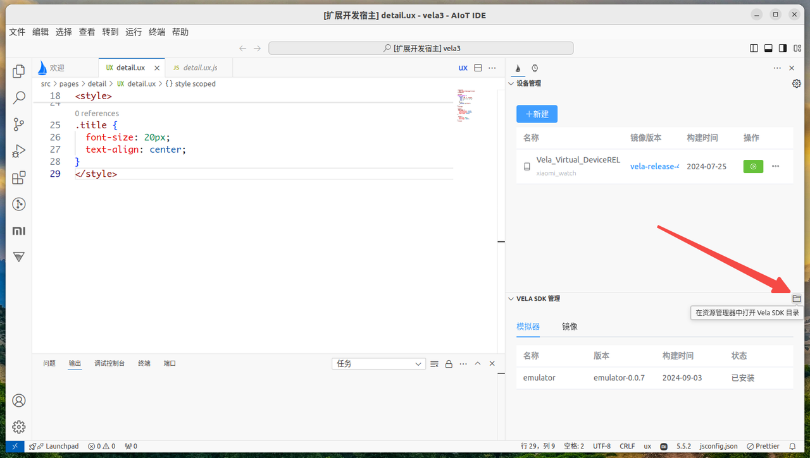

<!-- 源地址: https://iot.mi.com/vela/quickapp/zh/tools/debug/multi-screens.html -->

# 多屏适配

为了提升开发者开发体验，`AIoT-IDE`内置了****功能，可将一套代码跑在多个不同的设备屏幕上，以测试在不同屏幕上的适配效果。

## 多设备模拟器创建

为了还原最真实的多屏适配开发场景，`AIoT-IDE`提供了多个不同设备尺寸配置的模拟器和不同的镜像版本，以便在多种设备，不同镜像系统上测试应用。

`目前提供三种镜像可供选择`

  * `vela-miwear-watch-5.0` vela5.0稳定发布版本

  * `vela-miwear-watch-4.0` vela4.0稳定发布版本

  * `vela-watch-4.0` vela开发版本

**目前提供六种不同屏幕尺寸的设备可供创建：**


xiaomiWatch 466*466


redmiWatch


xiaomiBand


xiaomiBandpro


xiaomi10Band


xiaomiSoundMini

目前创建模拟器时，`vela-miwear-watch-5.0`和`vela-miwear-watch-4.0`只支持xiaomiWatch(466*466)尺寸一种设备，`vela-watch-4.0`支持上面全部设备类型，并且可自定义设备类型进行创建。

注意

模拟器与真实设备之间是有性能差异的

## 自定义模拟器

此外，为了支持更多尺寸的设备，创建模拟器时还可以选择**custom** 自定义模拟器时，提供以下自定义配置：

  * 1.可自定义模拟器宽高(宽高小于800大于100)，模拟器形状，模拟器密度等操作。
  * 2.可自定义并设置模拟器类型，目前主要为**watch** ，**band** ，**smartspeaker**
  * 3.可自定义模拟器形状，目前主要有两种形状**圆形** 和**矩形** ，矩形可自定义圆角
  * 4.可自定义模拟器屏幕dpi


点击底部新建按钮，完成模拟器创建后，`AIoT-IDE`右下角会弹出创建成功提示，设备管理页面会实时更新创建的模拟器。


## 多屏预览

在创建完不同设备类型的模拟器后，通过`调试`或`运行`按钮启动模拟器时，**选择对应不同设备的模拟器** 点击确定，即可同时运行。


运行成功后，模拟器预览页将出现不同设备屏幕的预览效果


## 自定义模拟器皮肤

此外，如果用户不仅仅满足于自定义模拟器的显示效果，希望能更逼真的预览模拟器设备，我们还提供了自定义皮肤的功能。

## Vela 模拟器皮肤组

制作一款皮肤共需要两张图片和一个配置文件：

  * `background.png` 是设备主体图，要求屏幕区域为黑色
  * `foreground.png` 用于遮挡模拟器画面以外的部分。
  * **layout配置文件** ，主要是用来配置皮肤所需的`background.png`，`foreground.png`布局信息


其中`foreground.png` 一般由背景图片中扣出模拟器画面部分并将屏幕部分修改为透明色。没有 `foreground.png` 与有 `foreground.png` 的对比如下:


未配置foreground.png


配置了foreground.png

## Layout 文件的制作

拷贝以下代码并按照注释修改信息即可，其余部分保持不变
```bash
parts { device { display { # 模拟器尺寸 width 466 # 模拟器尺寸 height 466 # x和y填 0 x 0 y 0 } } portrait { background { # 背景图片的名称 image background.png } foreground { # 前景图片的名称 mask foreground.png } } } layouts { portrait { // 整个皮肤的大小，一般使用背景图片的像素尺寸 width 572 height 938 event EV_SW:0:1 part1 { name portrait x 0 y 0 } part2 { name device # 前景图片从背景图片中扣图时的起始坐标，以左上角为0，0计算 x 54 y 236 } } } // 将会在创建模拟器时透传给底层配置的字段 props { // 屏幕形状。可选值： circle（圆形）、rect (矩形) 、pill-shaped（胶囊形屏eg: 全面屏手环） shape circle // 屏幕密度，可选值： [ '120' ， '140' ， '160' ， '180' ， '213' ， '240' ， '280' ， '320' ， '340' ， '360' ， '400' ， '420' ， '440' ， '480' ， '560' ， '640' ] density 320 // 设备类型，可选值：phone（手机）、watch（手表）、pad（平板）、car（车机）、tv（电视）、band（手环）smartspeaker（音响），默认watch flavor watch }
```

## 应用皮肤文件

在通过通过 `AIoT-IDE` 打开 `SKD` 目录，该目录下有一个 **skins** 目录，在 **skins/user** 目录下新建一个文件夹名称为你的皮肤名称，将制作好的文件放入其中，如果 skins下没有user，则先创建 user 目录 ，再次使用 IDE 创建模拟器时即可选择应用该皮肤。

注意

SDK目录是一个以点开头的目录，请提前打开操作系统的隐藏文件后再进行操作。



## layout详解

其中的 layout 文件中的内容如下：


**layout** 配置内容详解：

  * **layout** 中可定义 **portrait** 和 **landscape** 两种布局方式，即竖屏和横屏其中的**width** 和 **height** 为你的**background.png** 的像素大小

  * **event** 固定值填 **EV_SW:0:0**

  * **part1** 引用上方 parts 中定义背景图片和前景图的那个，name 表示 引用 part 的名称，x，y 表示布局开始的左边，以左上角开始为0，0

  * **part2** 引用上方 parts 中定义 **dispaly** 的那个，name 表示 引用 part 的名称，x，y 表示布局开始的坐标，以左上角开始为0，0

  * **parts** 定义皮肤的组成部分，一般又两部分组成，即皮肤和模拟器画面，带 **display** 的表示模拟器画面，带 **background** 和 **foreground** 的表示皮肤。

