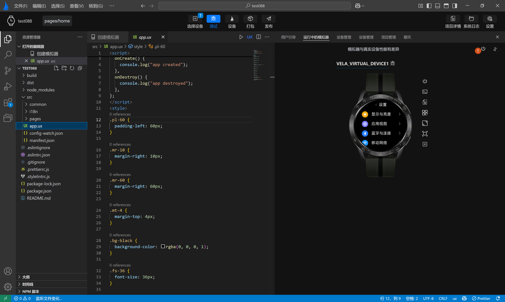
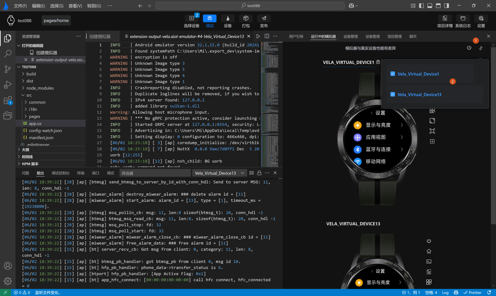
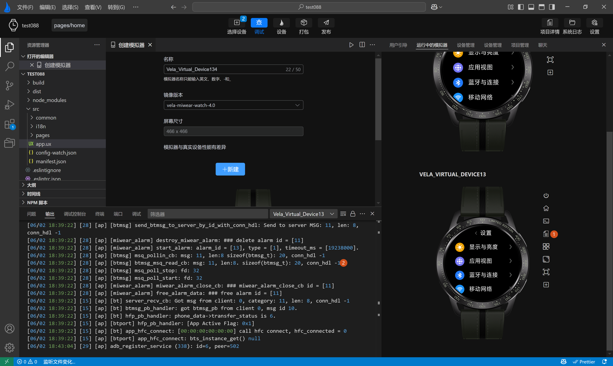

<!-- 源地址: https://iot.mi.com/vela/quickapp/zh/tools/debug/toolbar.html -->

# 功能按钮

在模拟器启动成功，进入模拟器运行页面后。`AIoT-IDE`提供了一些功能按钮方便开发者开发调试应用。

## 关闭所有模拟器

**关闭所有模拟器** ，位于模拟器运行页面右上角，点击后可关闭所有正在运行的模拟器，如下图中序号1所示。

## 自定义模拟器显示

**自定义模拟器显示** ，位于模拟器运行页面右上角，点击后可在弹出框中自定义已运行的模拟器的显示顺序，如下图序号1，序号2所示。

## 关机

关机，每个模拟器显示区域都会在右侧配置一个关机按钮，可关闭单个运行的模拟器，如下图序号1所示。

## 首页

首页，每个模拟器显示区域都会在右侧配置一个首页按钮，点击后可回到当前模拟器首页，如下图序号1，2所示。

## 终端

终端，每个模拟器显示区域都会在右侧配置一个终端按钮，点击进入模拟器命令行终端，如下图序号1，2所示。

## 查看日志

查看日志，每个模拟器显示区域都会在右侧配置一个查看日志按钮，点击进入可查看日志，如下图序号1，2所示。

## 菜单

菜单，每个模拟器显示区域都会在右侧配置一个菜单按钮，点击后可回到当前模拟器菜单页，如下图序号1所示。

## 截图

截图，每个模拟器显示区域都会在右侧配置一个截图按钮，点击可对当前模拟器效果进行截图，并选择有皮肤，无皮肤两种模式，如下图序号1，2所示。

## 尺寸

尺寸，每个模拟器显示区域都会在右侧配置一个尺寸按钮，可动态调整当前模拟器显示大小，如下图序号1，2所示。

## 安装rpk

安装rpk，每个模拟器显示区域都会在右侧配置一个安装rpk按钮，点击后选择本地rpk文件进行安装，如下图序号1，2所示。

## 运行rpk

运行rpk，每个模拟器显示区域都会在右侧配置一个运行rpk按钮，点击后在已安装的rpk列表中，切换运行的rpk或卸载已安装的rpk。如下图序号1，2，3所示。

