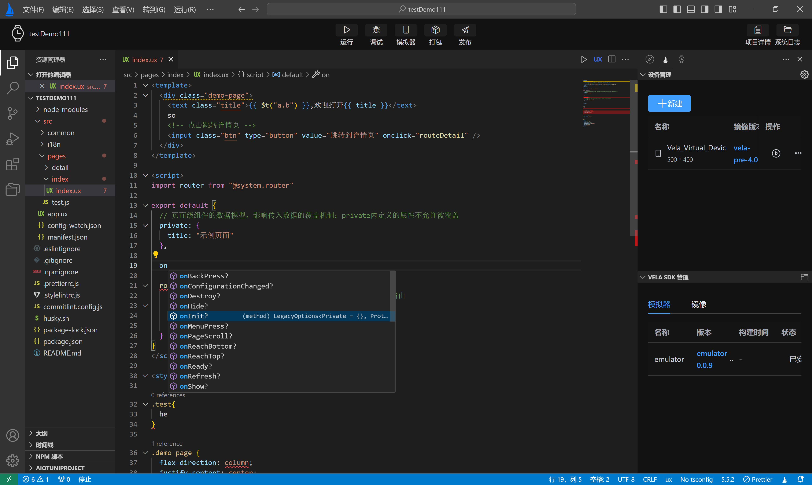
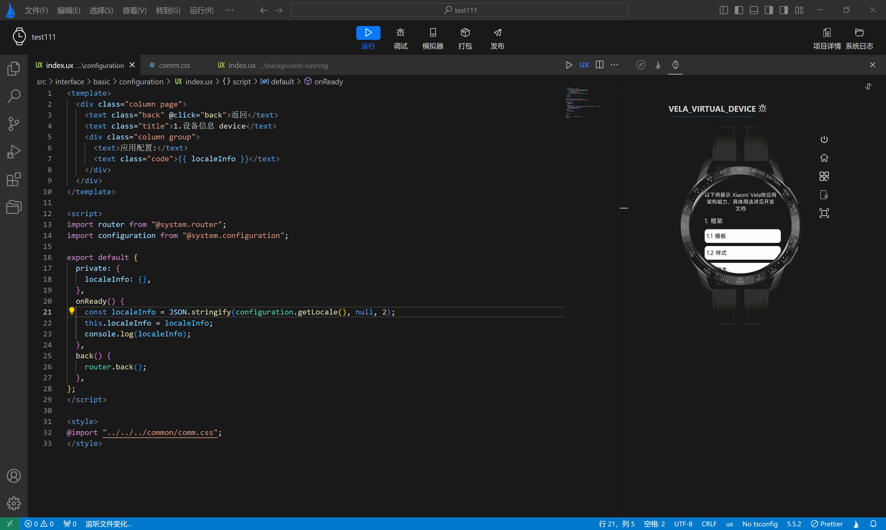

<!-- 源地址: https://iot.mi.com/vela/quickapp/zh/tools/dev/format.html -->

# 代码美化

## 自动格式化

代码自动格式化在软件开发中至关重要，它带来的好处包括增强代码一致性、提高可读性、简化审查过程，并支持敏捷开发实践。**`AIoT-IDE`** 提供此功能，但默认情况下是关闭的。要启用它，只需进行简单设置：

使用快捷键 Command ，（Windows 系统为 Ctrl ，）打开 设置 面板。 输入format进行搜索。

勾选「Editor: Format On Save」，如下图所示。

激活此选项后，每次保存时，系统都会自动使用 prettier 格式化代码。

**`Prettier`** 是一款流行的代码格式化工具，支持多种开发语言和文件格式，其目标是提供统一的代码风格，以简化代码维护并提高团队效率。**`AIoT-IDE`** 内置 prettier 依赖，您无需额外操作即可使用。具体效果如下动态图所示：

