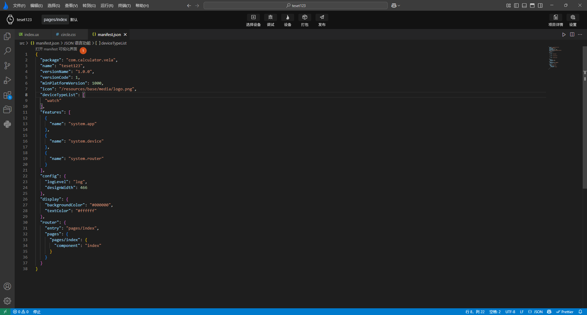

<!-- 源地址: https://iot.mi.com/vela/quickapp/zh/tools/dev/manifest.html -->

# 可视化编辑

`manifest.json`作为**Xiaomi Vela JS 应用** 的主要配置文件,`AIoT-IDE`中配置了可视化编辑界面，如下图所示：

点击打开manifest可视化界面后，可更直观清晰的对`manifest.json`进行编辑

